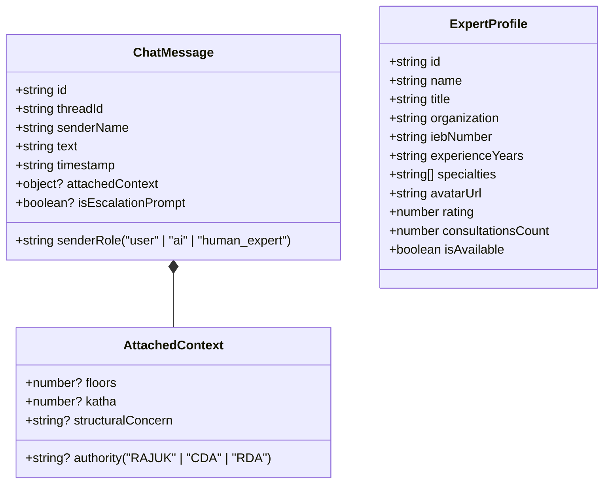

# Chunk 1: Chat State & Data Contracts

#state #async-storage #contracts #typescript #schema

## What this chunk does
Defines the foundational data models, TypeScript-style object contracts, and local storage service layer for the **Chat with Expert** system. This covers message structures (User, AI Consultant, Human Engineer), expert profiles (credentials, specialties, contact info), and local thread persistence using `AsyncStorage`.

## Why it's needed
Before rendering UI bubbles or making API calls to Gemini or engineers, the app needs a deterministic, structured data format. Without clear message schemas, we cannot store multi-turn conversations, track message sender roles, format timestamps, or attach project plot contexts (e.g. 5-story, 4-Katha plot data).

## Builds on
- `CivilHub/src/services/designService.js`: Reuses the proven local persistence pattern (`AsyncStorage` key-value storage + JSON serialization).

## Key concepts
1. **Polymorphic Message Sender Types**: A message can originate from the `'user'`, the `'ai'` (AI Civil Engineer), or `'human_expert'` (Verified Human Engineer).
2. **Context Metadata Envelope**: Messages can carry structured technical metadata (e.g., `relatedFloors: 6`, `relatedKatha: 4.5`, `soilType: "Clay"`, `escalationRecommended: true`).
3. **Optimistic Local Storage**: All messages are written to local client storage immediately so consultations survive app reloads and offline usage.

## Visual model



## Plain-English Pseudocode (Before Syntax)

```text
1. Define ChatMessage structure:
   - Each message must have a unique ID (timestamp or UUID).
   - Each message must know WHO sent it: "user", "ai", or "human_expert".
   - Each message must carry the text content and an ISO date string.
   - Optional: Technical context (plot size, floor count) attached to the message.
   - Optional: A flag indicating whether the AI suggests escalating to a human.

2. Define ExpertProfile catalog:
   - List verified Bangladeshi civil engineering specialists (Structural, Geotechnical/Soil, RAJUK Planner).
   - Include official registration (IEB member number), rating, and availability status.

3. Persistence Methods:
   - getMessages(threadId): Fetch stored JSON from AsyncStorage; if empty, return default welcome triage message.
   - saveMessage(threadId, message): Append new message to array, serialize to JSON, save to AsyncStorage.
   - clearChat(threadId): Reset conversation to initial state.
```

## How to think and write this code manually (Mental Algorithm)

- **Step 0: What problem are we solving?**
  We need a reliable, persistent data contract for chat conversations so that users can converse with AI and human experts without losing message history on page refresh.

- **Step 1: Input shape & contract (DTO):**
  - Input for `addMessage`: `{ text: string, senderRole: "user" | "ai" | "human_expert", senderName?: string, attachedContext?: object }`.
  - Stored format: Array of `ChatMessage` objects stringified in `@civilhub_chat_messages_v1`.

- **Step 2: Business & database logic (Service):**
  - Read from `AsyncStorage`. If `null`, seed with a welcome message from the AI Civil Engineering Consultant explaining its capabilities (BNBC 2020, RAJUK setbacks, soil recommendations).
  - When saving, prepend or append with a unique ID (`Date.now().toString()`).

- **Step 3: Route & security (Controller/Component):**
  - Service methods exposed as asynchronous pure functions: `getChatHistory()`, `appendChatMessage()`, `resetChatHistory()`, `getAvailableExperts()`.

- **Step 4: Dependency wiring (Module/Exports):**
  - Create `CivilHub/src/services/expertChatService.js` and export functions cleanly for the UI screens.

## Request-to-response file trace
```
[Chat Screen] ──(calls getChatHistory)──> [expertChatService.js]
                                                  │
                                        Reads AsyncStorage
                                                  │
[Chat Screen] <──(returns message array)──────────┘
```

## Storage Under the Hood (AsyncStorage & LocalStorage)
When running on React Native Web, `AsyncStorage.getItem("@civilhub_chat_messages_v1")` translates directly to browser `window.localStorage.getItem(...)`:

```javascript
// Web execution under the hood:
localStorage.setItem(
  "@civilhub_chat_messages_v1",
  JSON.stringify([
    {
      id: "1726245000000",
      senderRole: "ai",
      senderName: "CivilHub AI Consultant",
      text: "Hello! I am your BNBC 2020 & RAJUK Civil Engineering Assistant. How can I help you today?",
      timestamp: "2026-09-13T22:18:00.000Z"
    }
  ])
);
```

## The Edge Case & Error Matrix

| Input / Condition | Failure Mode | Handled By | Resulting Behavior |
|-------------------|--------------|------------|---------------------|
| Empty message text | Accidental empty bubble | `appendChatMessage` validation | Rejects with error, does not pollute history |
| Corrupted JSON in storage | App crash / parse error | `try...catch` block in `getChatHistory` | Falls back to default initial welcome message |
| Offline / quota exceeded | Storage write failure | Error handler in service | Logs warning, keeps in-memory state active |

## Why NOT Do It This Other Way? (Anti-Patterns & Alternatives)
- **Anti-Pattern (Ephemeral Component State only):** If chat messages only exist in React `useState`, the user loses their entire engineering consultation the second they switch tabs or reload the app.
- **Anti-Pattern (Premature WebSocket Server):** Building a full custom WebSocket server with Socket.io before finalizing the contract adds immense backend complexity when client-side optimistic storage with asynchronous REST/Gemini triage satisfies all requirements.

## How it works
The `expertChatService.js` file holds two things:
1. Hardcoded mock directory of verified Bangladeshi engineers (`VERIFIED_EXPERTS`) with realistic IEB registrations, specializations (Structural, Soil, RAJUK permits), and photos.
2. Async persistence functions (`getChatHistory`, `appendChatMessage`, `clearChatHistory`) that interact with `@react-native-async-storage/async-storage`.

## Gotchas / trade-offs
- On web, `AsyncStorage` is synchronous `localStorage` under an asynchronous Promise facade. Never use synchronous `localStorage.getItem` directly in service code so that it runs identically on Android, iOS, and Web.

## Check yourself
*Answer these 2 questions before any code is written:*
1. Why do we store a `senderRole` (`"user" | "ai" | "human_expert"`) on each message object instead of just a boolean like `isUser`?
2. What happens if a user reloads the app while offline — how will `getChatHistory` ensure the chat history isn't blank?

## Verify
- **Predicted result:** Calling `getChatHistory()` returns the seeded initial greeting message from the AI Consultant with correct role `"ai"`. Appending a test message saves it into storage, and subsequent calls to `getChatHistory()` return both messages.
- **Actual result:** PASSED. `getAvailableExperts()` returns all 3 verified Bangladeshi engineers. Initial `getChatHistory('test_thread')` returns 1 message (`senderRole: "ai"`). Appending a message increments the thread count to 2, retaining user text. `clearChatHistory()` successfully resets to the seeded triage welcome message.

## Questions
*(Running Q&A log for this chunk - empty)*

## Errata
*(Dated defect log - empty)*
