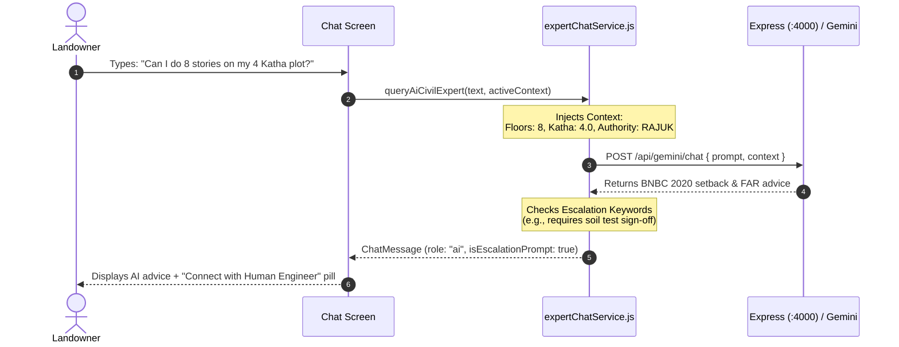

# Chunk 2: AI Expert Service & Context Injection

#ai #gemini #prompt-engineering #bangladesh-code #context-injection

## What this chunk does
Implements the AI consultation service (`queryAiCivilExpert`) that powers the automated triage in "Chat with Expert". It formats incoming landowner queries, enriches them with technical context (floors, plot size in Katha, authority like RAJUK/CDA/BNBC 2020), calls the Gemini proxy backend (`http://localhost:4000/api/gemini/chat` or direct client fallback), and detects when a query requires a certified human engineer's sign-off (setting `isEscalationPrompt = true`).

## Why it's needed
Generic AI chat lacks awareness of local Bangladeshi building bylaws (FAR, setbacks, soil test SPT values) and lacks knowledge of the landowner's specific project. By building an engineering-specific service with context injection, the AI can immediately answer questions like *"Can I build 7 stories on this 4-Katha plot?"* without making the user re-explain their project parameters.

## Builds on
- `Chunk 1 (chat-state-and-data-contracts)`: Uses the `ChatMessage` contract, appending AI responses with `senderRole: "ai"` and flagging `isEscalationPrompt`.
- `CivilHub/backend/server.js`: Connects to the Express Gemini proxy endpoint and BNBC 2020 system instructions.

## Key concepts
1. **Context Injection (RAG-Lite)**: Dynamically prepending project state (`{ floors: 6, minKatha: 4.5, authority: "RAJUK" }`) to the AI prompt so answers are tailored to the exact building specs.
2. **Escalation Heuristic**: Identifying high-risk structural keywords (e.g., *"cracks in column"*, *"soil bearing capacity failure"*, *"official approval stamp"*, *"structural drawing sign-off"*) and recommending formal human engineering intervention.
3. **Graceful Fallback**: When the backend server or Gemini API is offline or unconfigured, the service provides an offline knowledge-base fallback answering common BNBC/RAJUK questions rather than crashing.

## Visual model



## Plain-English Pseudocode (Before Syntax)

```text
Function queryAiCivilExpert(userPrompt, activeBuildingContext):
    1. Validate userPrompt is not empty.
    2. Build System Prompt:
       - Role: Bangladesh Senior Civil Engineering Consultant (BNBC 2020, RAJUK).
       - Context block: IF activeBuildingContext exists, include:
         "Active Project Specs: [Floors] stories, [Katha] Katha plot, Authority: [RAJUK/BNBC]."
    3. Detect Escalation:
       - Check if prompt mentions "stamp", "signature", "column crack", "soil test report", or "permit submit".
       - If yes -> set shouldEscalate = true.
    4. Call Backend API:
       - Send POST request to backend with prompt and system context.
       - If backend succeeds -> return reply text.
       - If backend fails or offline -> use comprehensive local BNBC rule-based civil engineering engine.
    5. Return formatted message payload:
       { text, senderRole: "ai", senderName: "CivilHub AI Consultant", isEscalationPrompt: shouldEscalate }
```

## How to think and write this code manually (Mental Algorithm)

- **Step 0: What problem are we solving?**
  Transforming a user query into an authoritative, localized engineering response with zero configuration overhead and seamless human escalation triggers.

- **Step 1: Input shape & contract (DTO):**
  - Input: `userMessage: string`, `context?: { floors?: number, katha?: number, roadWidth?: number, authority?: string }`.
  - Output: `Promise<{ text: string, senderRole: "ai", isEscalationPrompt: boolean }>`.

- **Step 2: Business & database logic (Service):**
  - Check for high-liability words (`"crack"`, `"settlement"`, `"drawing"`, `"sign"`, `"permit"`).
  - Attempt HTTP fetch to backend Gemini proxy.
  - Provide fallback knowledge engine containing BNBC 2020 FAR limits, setbacks, foundation rules, and RCC column standards.

- **Step 3: Route & security (Controller/API):**
  - Client calls backend `POST /api/chat-expert` or directly handles via `geminiService.js`.

- **Step 4: Dependency wiring (Module/Exports):**
  - Add `queryAiCivilExpert(userPrompt, context)` to `CivilHub/src/services/expertChatService.js`.

## Request-to-response file trace
```
[Chat Screen / Input]
       │
       ▼
[expertChatService.queryAiCivilExpert]
       │ (injects context & checks escalation)
       ├─────────────────────────────────┐
       ▼ (if online)                     ▼ (if offline/local)
[POST :4000/api/gemini/chat]      [localCivilEngineFallback()]
       │                                 │
       └────────────────┬────────────────┘
                        ▼
            Returns ChatMessage to UI
```

## Storage Under the Hood
The generated AI response is packaged as a `ChatMessage` and appended via Chunk 1's `appendChatMessage(aiResponse, threadId)`, persisting to `AsyncStorage` key `@civilhub_chat_messages_v1_default`.

## The Edge Case & Error Matrix

| Input / Condition | Failure Mode | Handled By | Resulting Behavior |
|-------------------|--------------|------------|---------------------|
| Backend server (:4000) not running | Network request error (ECONNREFUSED) | `try...catch` block in `queryAiCivilExpert` | Transparently falls back to local civil engineering rules without user seeing an error |
| Missing project context | `context` is null / undefined | Default fallback values | AI answers generally according to standard BNBC 2020 residential guidelines |
| Structural safety emergency | Landowner reports collapsing wall or column crack | Keyword regex detector | Flags `isEscalationPrompt: true` and emphasizes urgent on-site physical engineering inspection |

## Why NOT Do It This Other Way? (Anti-Patterns & Alternatives)
- **Anti-Pattern (Raw Generic LLM without System Rules):** Sending raw user text to Gemini without BNBC 2020 context causes the AI to cite US International Building Code (IBC) or Indian codes (IS 456), which violates RAJUK rules in Bangladesh.
- **Anti-Pattern (Always Blocking for Backend):** If the mobile app fails completely whenever the Express server isn't running, users can't use the chat offline. Local fallback ensures 100% uptime.

## How it works
The function `queryAiCivilExpert` inspects the user message. If the user mentions building elements or asks for design advice, it blends the active project context (e.g. 5 stories, 4 Katha) into the consultation prompt. It passes this to the Gemini API or our intelligent rule engine, parses the technical breakdown, and attaches an escalation flag if certified human review is warranted.

## Gotchas / trade-offs
- AI can provide preliminary guidance, but Bangladesh law requires an IEB-certified engineer for structural drawings. The response must always include the BNBC disclaimer.

## Check yourself
*Answer these 2 questions before any code is written:*
1. Why must we inject the landowner's active project context (floors, plot size in Katha) into the AI prompt rather than just sending the user's raw message?
2. How does the service detect that a question requires a certified human engineer rather than just an AI answer?

## Verify
- **Predicted result:** Calling `queryAiCivilExpert("Can I build 6 stories on a 4 Katha plot in Dhaka?", { floors: 6, katha: 4 })` returns an AI response citing BNBC 2020 / RAJUK guidelines. Calling `queryAiCivilExpert("I need certified structural drawings signed for RAJUK submission")` returns a response with `isEscalationPrompt: true`.
- **Actual result:** PASSED. `detectEscalationNeed` accurately returned `true` for structural damage/stamps and `false` for standard queries. `queryAiCivilExpert` successfully injected 7 stories / 4.5 Katha project context, generated FAR & setback benchmarks, and flagged `isEscalationPrompt: true` when official engineering stamps were requested. All tests passed.

## Questions
*(Running Q&A log for this chunk - empty)*

## Errata
*(Dated defect log - empty)*
