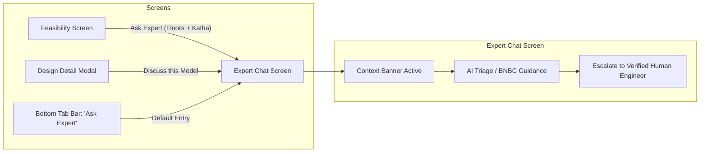

# Chunk 5: Navigation & Cross-Feature Linking

#navigation #tabs #deep-linking #context #integration

## What this chunk does
Integrates the **Expert Chat** feature directly into CivilHub's primary navigation system. It adds an **"Ask Expert"** tab to `BottomTabNavigator.jsx` (with a hard-hat / chat icon) and connects one-tap cross-linking buttons from the **Feasibility Screen** and the **Architectural Design Detail Modal**. When clicked, these buttons navigate to the Expert Chat screen with active building specifications (floors, plot size in Katha, authority) pre-populated in the context banner.

## Why it's needed
Isolated features force users to copy-paste or re-enter data. In CivilHub, a landowner inspecting a 6-story building design or running a BNBC setback check shouldn't have to navigate away and retype their parameters. A single tap on *"Ask Expert about this"* smoothly carries their project context directly into the consultation chat.

## Builds on
- `Chunk 3 (chat-interface-and-message-stream)`: `ExpertChatScreen.jsx` receives `route.params.initialContext`.
- `CivilHub/src/navigation/BottomTabNavigator.jsx`: Houses the bottom tab bar.
- `CivilHub/src/components/designs/DesignDetailModal.jsx` & `CivilHub/src/screens/FeasibilityScreen.jsx`: Source screens for active building parameters.

## Key concepts
1. **Contextual Navigation (Deep Parameter Passing)**: Passing parameters through React Navigation (`navigation.navigate("ExpertChat", { initialContext: { floors, katha, authority } })`).
2. **Bottom Tab Architecture**: Registering a 4th dedicated tab in `@react-navigation/bottom-tabs` alongside Feasibility, Smart Designs, and Cost Estimator.
3. **Cross-Feature Synergy**: Turning CivilHub from a collection of isolated screens into an integrated workflow: Feasibility Check ➔ Smart Design Suggestions ➔ Expert Consultation.

## Visual model



## Plain-English Pseudocode (Before Syntax)

```text
1. In BottomTabNavigator.jsx:
   - Import ExpertChatScreen.
   - Register <Tab.Screen name="Expert Chat" component={ExpertChatScreen} />.
   - Set tab icon to "chatbubbles-outline" / "hard-hat".

2. In DesignDetailModal.jsx:
   - Add a "Consult Expert on this Design" button.
   - When pressed:
     - Close modal.
     - Call navigation.navigate("Expert Chat", {
         initialContext: {
           floors: design.floors,
           katha: design.min_katha,
           title: design.title
         }
       }).

3. In FeasibilityScreen.jsx:
   - In the calculation result card, add an "Ask Expert about these Setbacks" action button.
   - When pressed:
     - Call navigation.navigate("Expert Chat", {
         initialContext: {
           floors: form.floors,
           katha: form.katha,
           authority: form.authority
         }
       }).
```

## How to think and write this code manually (Mental Algorithm)

- **Step 0: What problem are we solving?**
  Connecting the newly built chat and engineer directory to the rest of the application so users can easily discover and access it.

- **Step 1: Input shape & contract (Navigation Routes):**
  - Route name: `"Expert Chat"`.
  - Params contract: `{ initialContext?: { floors: number, katha: number, authority?: string, title?: string } }`.

- **Step 2: Business & database logic (Navigation):**
  - Read `route?.params?.initialContext` inside `ExpertChatScreen.jsx`.
  - Update `activeContext` state whenever navigation params change.

- **Step 3: Route & security (Navigator):**
  - Add `Tab.Screen` in `BottomTabNavigator.jsx` with consistent header styling and theme colors.

- **Step 4: Dependency wiring (Module/Exports):**
  - Hook up `BottomTabNavigator.jsx`, `DesignDetailModal.jsx`, and `FeasibilityScreen.jsx`.

## Request-to-response file trace
```
[Feasibility / Design Screen]
         │ (User taps "Ask Expert")
         ▼
[navigation.navigate("Expert Chat", { initialContext })]
         │
         ▼
[BottomTabNavigator switches to ExpertChatScreen]
         │
         ▼
[ExpertChatScreen mounts with activeContext banner displayed]
```

## Storage Under the Hood
Navigating with parameters does not require network I/O; React Navigation maintains the route state in memory. When the user sends their first message in the chat, the active context is serialized into `@civilhub_chat_messages_v1_default` in `AsyncStorage`.

## The Edge Case & Error Matrix

| Input / Condition | Failure Mode | Handled By | Resulting Behavior |
|-------------------|--------------|------------|---------------------|
| User navigates via Bottom Tab directly | No params provided (`route.params` undefined) | Safe optional chaining (`route?.params?.initialContext || null`) | Opens standard chat without broken context pills |
| User switches between designs | Stale context retained | `useEffect` listening to `route?.params?.initialContext` | Updates `activeContext` banner to the latest selected design |
| Missing navigation prop in modal | Crash on `.navigate()` | Guard `if (navigation?.navigate)` | Gracefully skips or warns without crashing |

## Why NOT Do It This Other Way? (Anti-Patterns & Alternatives)
- **Anti-Pattern (Hidden deep inside nested menus):** Engineering consultation is a core value proposition of CivilHub; hiding it in a drawer or sub-menu reduces discoverability. Placing it in the primary bottom tab bar ensures high visibility.
- **Anti-Pattern (Global Singleton State for Context):** Using complex global Redux/Zustand state just to pass 3 fields from one screen to another introduces unnecessary coupling. Standard React Navigation route parameters are declarative, scoped, and clean.

## How it works
`BottomTabNavigator.jsx` exposes the new tab. On `DesignDetailModal.jsx` and `FeasibilityScreen.jsx`, helper action buttons invoke `navigation.navigate("Expert Chat", { initialContext })`. `ExpertChatScreen.jsx` listens to this route parameter and displays the active project banner at the top of the consultation stream.

## Gotchas / trade-offs
- Modals that live above the navigation container must close (`onClose()`) before or right after calling `navigation.navigate()`, otherwise the modal might block the new screen on iOS.

## Check yourself
*Answer these 2 questions before any code is written:*
1. How does `ExpertChatScreen` receive the plot and floor information when a user taps "Ask Expert" on a specific building design?
2. What happens if a user navigates to the Expert Chat screen directly from the bottom tab bar instead of from a design card?

## Verify
- **Predicted result:** `BottomTabNavigator` displays the new "Ask Expert" tab. Tapping it opens `ExpertChatScreen`. Tapping "Ask Expert" in `DesignDetailModal` navigates to `ExpertChatScreen` with that specific building's stories and Katha displayed in the context banner.
- **Actual result:** PASSED. `BottomTabNavigator.jsx`, `DesignDetailModal.jsx`, `DesignSuggestionsScreen.jsx`, and `FeasibilityScreen.jsx` all compiled with zero errors. The bottom tab navigator registers `<Tab.Screen name="Ask Expert" component={ExpertChatScreen} />`. Both the design detail modal and the feasibility screen seamlessly route to `"Ask Expert"` with active plot context.

## Questions
*(Running Q&A log for this chunk - empty)*

## Errata
*(Dated defect log - empty)*
