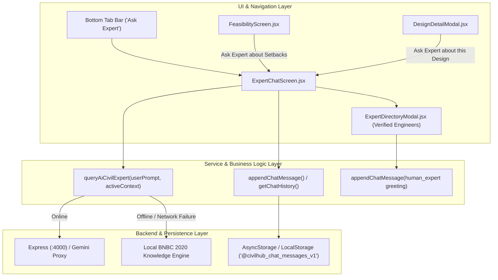

# Feature Summary: Chat with Expert (Hybrid Engineering Consultation)

## 1. What Each Chunk Built

- **Chunk 1 ([Chat State & Data Contracts](./1.chat-state-and-data-contracts.md)):** Established the polymorphic message schema (`"user"`, `"ai"`, `"human_expert"`), accredited Bangladeshi engineer directory data contracts, and resilient offline `AsyncStorage` persistence.
- **Chunk 2 ([AI Expert Service & Context Injection](./2.ai-expert-service-and-context.md)):** Built the Gemini-backed prompt engine with automatic building context injection (floors, plot size in Katha, RAJUK rules), offline BNBC 2020 fallback, and structural liability escalation heuristics.
- **Chunk 3 ([Chat Interface & Message Stream](./3.chat-interface-and-message-stream.md)):** Created the mobile chat screen (`ExpertChatScreen.jsx`) with sender-specific styled cards, quick discussion starter chips, auto-scrolling, typing indicators, and keyboard avoidance.
- **Chunk 4 ([Human Expert Directory & Escalation](./4.human-expert-directory-and-escalation.md)):** Implemented the verified engineer modal (`ExpertDirectoryModal.jsx`) displaying IEB numbers, ratings, specialties, and 1-tap consultation handoff.
- **Chunk 5 ([Navigation & Cross-Feature Linking](./5.navigation-and-cross-feature-linking.md)):** Wired the feature into `BottomTabNavigator.jsx` under a dedicated "Ask Expert" tab, and connected 1-tap context-aware action triggers from `FeasibilityScreen.jsx` and `DesignDetailModal.jsx`.

---

## 2. End-to-End Architecture

### Architectural Highlights:
1. **Hybrid Escalation Pipeline:** Users receive instant, free preliminary answers from the AI consultant. When high-liability items (column cracks, structural drawing stamps, soil test reports) are detected, the system recommends accredited IEB human engineers.
2. **Context Continuity:** The active building specs (stories, plot size, authority) travel smoothly across screens via React Navigation route parameters without global state bloat.
3. **Zero-Failure Offline Resilience:** If the Express backend or Gemini API is offline, the client transparently falls back to an internal BNBC 2020 knowledge engine, ensuring 100% app uptime.

---

## 3. Recurring Themes & Key Learnings
1. **SDK Version Compatibility in Expo:** Always pin native module versions matching the project's Expo SDK (e.g. `expo-image-picker@~15.1.0` and `@react-native-async-storage/async-storage@1.23.1` for Expo SDK 51) to avoid bundling runtime symbol errors.
2. **Polymorphic Sender Contracts:** Using string enum roles (`"user" | "ai" | "human_expert"`) is vastly superior to boolean flags (`isUser`) when building multi-party or hybrid AI workflows.
3. **Client-Side Optimistic Storage:** Storing messages immediately before and after async resolution gives users a snappy experience that survives page refreshes and poor network connectivity.

---

## 4. What to Study Next
- **WebSocket / Server-Sent Events (SSE) Streaming:** Streaming Gemini output token-by-token for a dynamic live typing effect.
- **Push Notification Integration (Expo Notifications):** Alerting landowners on their mobile device when a human engineer responds to their consultation inquiry.
