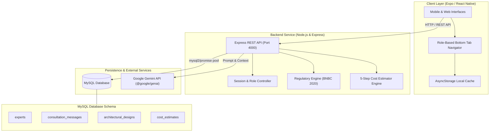
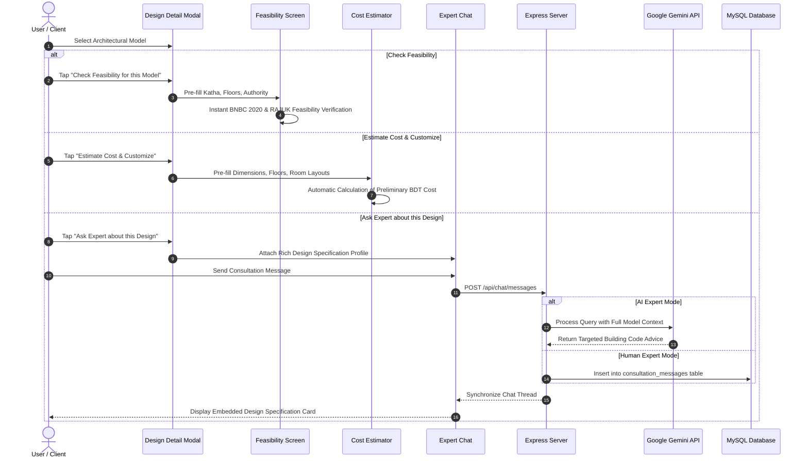

# CivilHub - Civil Engineering & Architectural Intelligence Platform

CivilHub is a comprehensive civil engineering, architectural planning, and building code compliance platform tailored for Bangladesh construction regulations (BNBC 2020, RAJUK, CDA, RDA, KDA). It combines automated regulatory feasibility analysis, architectural model exploration, detailed construction cost estimation, land tax calculations, and dual-mode expert consultations powered by Google Gemini and verified human engineers.

---

## Key Modules and Features

### 1. Feasibility Checker & Building Code Engine
- Evaluates plot dimensions, frontage road widths, and target stories against municipal bylaws (RAJUK, CDA, RDA, KDA, and General Municipalities).
- Analyzes Floor Area Ratio (FAR), Maximum Ground Coverage (MGC), and mandatory setback clearances.
- Real-time AI advisory backed by Bangladesh National Building Code (BNBC 2020) guidelines.

### 2. Smart Architectural Designs Catalog
- Curated architectural designs and residential/commercial layouts with 3D elevations and floor plan specifications.
- Filter by plot requirement (Katha), story count, architectural style, and units per floor.
- Direct cross-module workflows:
  - Check Feasibility for Model (pre-fills plot size and story requirements).
  - Estimate Cost & Customize (pre-populates floor dimensions and structural options).
  - Ask Expert about Model (attaches full architectural specifications to consultation threads).

### 3. Bangladesh Construction Cost Estimator
- 5-step estimation workflow covering Land Data, Bylaw Verification, Floor-wise Room Sizing, Material Quality Profiles, and Cost Summaries.
- Dynamic recalculation supporting custom floor counts, room dimensions, basements, and garages.
- Itemized BDT cost breakdown including structural civil work, interior/exterior finishes, plumbing, electrical, and regulatory approval costs.

### 4. Land Tax & Transfer Duty Calculator
- Computes stamp duty, registration fees, gain tax, local government tax, and mutation costs according to current Bangladesh revenue laws.
- Supports mouza classifications, municipal tiers, and property value adjustments.

### 5. Dual-Mode Expert Consultation Chat
- CivilHub AI Assistant: Instant regulatory and structural compliance queries via Google Gemini.
- Verified Human Expert Directory: Messenger-style multi-expert messaging with licensed Architects, Structural Engineers (PEng/MIEB), and Geotechnical Specialists.
- Embedded Design Specification Cards: Rich architectural snapshots embedded directly into chat messages with interactive modal inspection.
- Role-based interfaces for Clients and Logged-in Engineers with real-time polling (2.5s) and MySQL database synchronization.

---

## Architecture and System Design

### System Component Architecture



### Cross-Module Interaction Flow



---

## Project Structure

```
Civilhub/
├── README.md
├── CivilHub/
│   ├── App.js                         # Application root and session bootstrap
│   ├── app.json                       # Expo configuration
│   ├── package.json                   # Mobile and web client dependencies
│   ├── backend/
│   │   ├── server.js                  # Express API server and route handlers
│   │   ├── db.js                      # MySQL schema initialization and pooling
│   │   ├── package.json               # Backend dependencies
│   │   ├── .env                       # Backend environment configuration (gitignored)
│   │   └── .env.example               # Example environment variables template
│   └── src/
│       ├── navigation/
│       │   └── BottomTabNavigator.jsx # Role-based bottom navigation bar
│       ├── screens/
│       │   ├── FeasibilityScreen.jsx       # Regulatory check and code assistant
│       │   ├── DesignSuggestionsScreen.jsx # Architectural models catalog
│       │   ├── CostEstimatorScreen.jsx     # 5-step construction cost estimator
│       │   ├── LandTaxScreen.jsx           # Property tax and registration duties
│       │   ├── ExpertChatScreen.jsx        # Dual-mode AI & human chat interface
│       │   └── LoginScreen.jsx             # Role-based authentication modal
│       ├── components/
│       │   ├── FeasibilityForm.jsx         # Feasibility evaluation form
│       │   ├── AIChatbotModal.jsx          # Standalone AI chatbot modal
│       │   └── designs/
│       │       ├── DesignCard.jsx          # Architectural preview card
│       │       ├── DesignDetailModal.jsx   # Detailed design inspector and editor
│       │       ├── DesignFilterModal.jsx   # Multi-parameter filter sheet
│       │       └── AddDesignModal.jsx      # Upload and creation modal
│       └── services/
│           ├── apiConfig.js                # Centralized backend URL configuration
│           ├── costEstimator.js            # Estimation formulas and rate databases
│           ├── designService.js            # Architectural model CRUD operations
│           ├── expertChatService.js        # Consultation history and Gemini integration
│           └── feasibilityRules.js         # BNBC and municipal setback rules
```

---

## Getting Started

### Prerequisites
- Node.js (v18.0.0 or higher recommended)
- npm or yarn
- MySQL Server (v8.0 or higher)

### 1. Database Setup
Ensure MySQL is running and create the database:

```sql
CREATE DATABASE IF NOT EXISTS civilhub_db;
```

The application automatically creates and migrates required tables (`experts`, `consultation_messages`, etc.) upon server startup.

### 2. Backend Configuration & Startup

Navigate to the backend directory:

```bash
cd CivilHub/backend
npm install
```

Create a `.env` file from `.env.example`:

```bash
cp .env.example .env
```

Configure the environment variables in `CivilHub/backend/.env`:

```env
PORT=4000
DB_HOST=localhost
DB_PORT=3306
DB_USER=root
DB_PASSWORD=your_mysql_password
DB_NAME=civilhub_db
GEMINI_API_KEY=your_google_gemini_api_key
```

Start the backend server:

```bash
npm start
```

The backend server will run on `http://localhost:4000`.

### 3. Frontend Setup & Launch

In a separate terminal, navigate to the frontend directory:

```bash
cd CivilHub
npm install
```

Start the application using Expo:

```bash
# Web browser
npm run web

# Android emulator / device
npm run android

# iOS simulator (macOS only)
npm run ios
```

---

## Network Configuration for Mobile Devices

The frontend connects to the backend through `CivilHub/src/services/apiConfig.js`:

- Web Browser / iOS Simulator: `http://localhost:4000`
- Android Emulator: `http://10.0.2.2:4000`
- Physical Mobile Device: `http://<your-local-ip>:4000` (e.g. `http://192.168.1.50:4000`)

---

## Demo Credentials for Testing

The platform supports both Client and Engineer sessions:

| Role | Email / Identifier | Password | Access Scope |
|---|---|---|---|
| Client | client@civilhub.com | client123 | Full suite (Feasibility, Designs, Cost, Tax, Ask Expert) |
| Architect | architect@civilhub.com | expert123 | Dedicated Client Consultation Workspace |
| Structural Engineer | structural@civilhub.com | expert123 | Dedicated Client Consultation Workspace |
| Soil Engineer | soil@civilhub.com | expert123 | Dedicated Client Consultation Workspace |

---

## License

This project is proprietary and confidential. All rights reserved.
